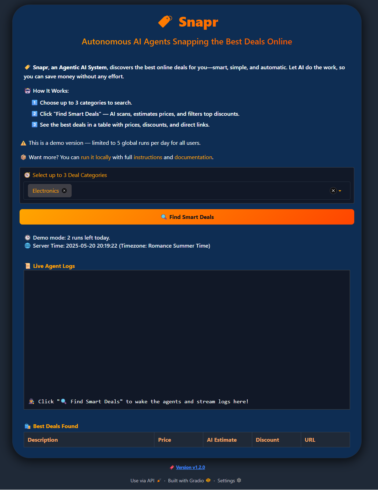

# 🏷️ Snapr - Multi-AI Agent Snaps Best Deals

- [🚀 Live Demo on Hugging Face](https://huggingface.co/spaces/lisekarimi/snapr)
- [📚 Full Documentation](https://lisekarimi.github.io/snapr)

📷 **Screenshots**

---

## 📖 Overview 
**Snapr** is an AI-powered system that finds the best online deals using a pipeline of collaborative agents powered by LLMs, traditional ML models, embeddings, and retrieval-augmented generation (RAG).

### ⚙️ Key Capabilities
- Central agent orchestrates deal processing with specialized agents
- Real-time deal fetching and price prediction using LLMs and traditional models
- Automatic filtering and memory to avoid duplicates
- Remote execution on Modal with live activity logs
- DevOps: Docker, CI/CD with GitHub Actions, pre-commit hooks
- Unit testing, security checks, and code quality enforcement
- Auto-generated changelogs with LLM and MkDocs-based documentation

👉 For full details, see [Core Features and Development & DevOps.](https://lisekarimi.github.io/snapr).

---

## ⚙️ Setup & Installation 

To set up locally and install the app, see the "Local Deployment" section in the [technical documentation](https://lisekarimi.github.io/snapr/technical/localdev/).

---

## 📚 Docs & Architecture

- Documentation includes:

    - Technical and functional docs
    - Schematics of technical architecture, functional workflow, and user flow

---

## 🪪 License

MIT
