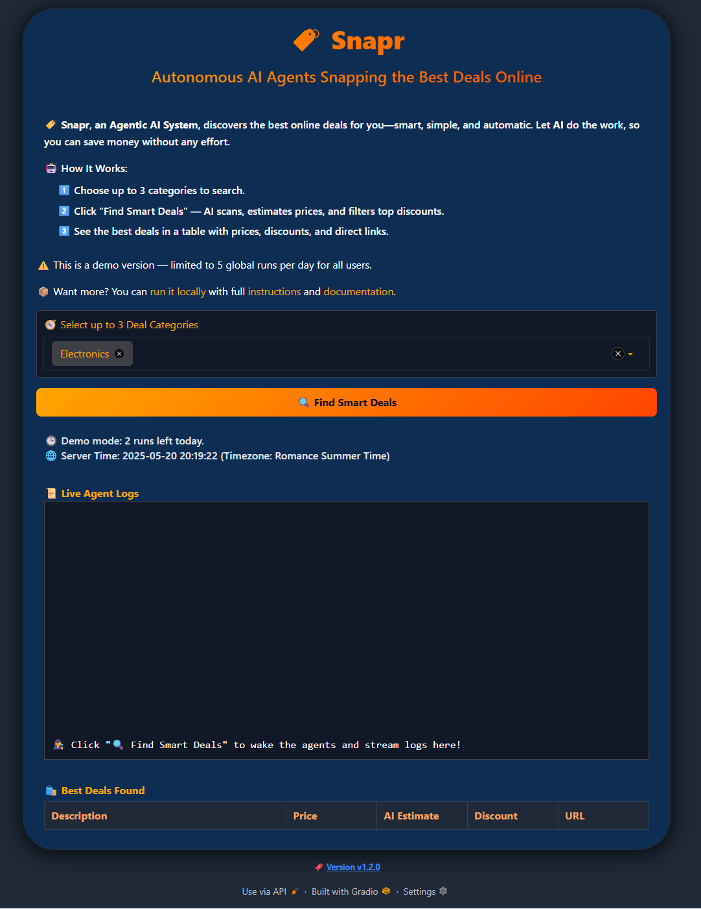

# 🎨 User Interface

This section describes the inputs, outputs, and interactive components available in the {{ PROJECT_NAME_DISPLAY }} user interface. 

The app is built with `Gradio` and designed for a smooth, informative user experience with minimal effort.

---

## 📥 Inputs

### Category Selection
- A dropdown menu allows the user to select up to **3 product categories**.
- Validation prevents selecting zero or more than three categories.

### Action Button
- **“Find Smart Deals”**: triggers the full deal pipeline.
- The button becomes disabled while processing and re-enabled after results are displayed.

### Information & Status
- Displayed above the action button:
    - Brief explanation of the app’s purpose
    - Current **demo usage status** (remaining global runs)
    - Time info synced with **server timezone** to avoid confusion

---

## 📤 Outputs

### Results Table
- Displays only **accepted deals** that meet the discount threshold.
- Columns include:
      - Product description
      - Actual price
      - Estimated price
      - Discount
      - Direct product link

### Agent Logs
- A live **log panel** shows real-time activity from agents.
- Includes messages like:
    - Fetching deals
    - Model predictions
    - Deal rejections or acceptance
    - Errors (if any)

### Status Messages
- Inline messages inform the user of:
      - Validation issues (e.g., no category selected)
      - Usage limits exceeded
      - Internal errors (e.g., model failure)

