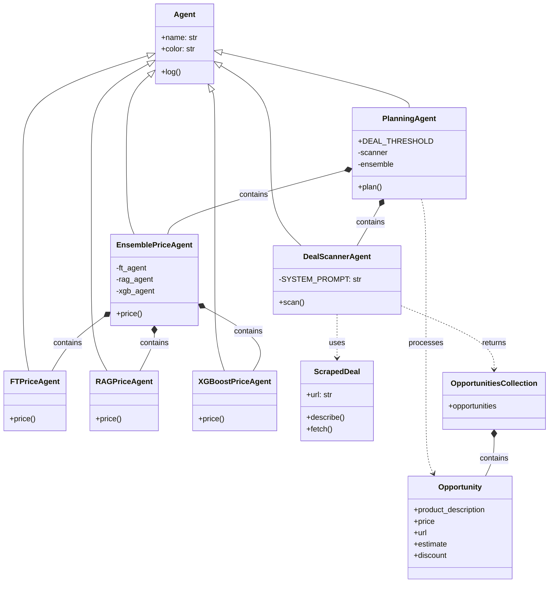

# 🤖 AI Agents

{{ PROJECT_NAME_DISPLAY }}'s backend is built around modular AI agents, each encapsulated in a Python class that performs a distinct function within the deal processing pipeline. All agents inherit from a common `Agent` base class and are orchestrated by the `PlanningAgent`.

Most agents — including `FTPriceAgent`, `RAGPriceAgent`, `XGBoostAgent`, and `EnsemblePriceAgent` — are deployed remotely via **Modal** for GPU acceleration and scalable execution.

This section provides a technical summary of each agent’s:
    - Input/output interface  
    - Execution context  
    - Internal responsibilities

A class diagram is included to visualize the relationships and architecture.

---

## 🧩 Agent Summary Table

| Agent                  | Input                               | Output                  | Notes                                                            |
|------------------------|-------------------------------------|--------------------------|------------------------------------------------------------------|
| **PlanningAgent**      | Selected categories                 | Accepted deals           | Orchestrates all agents; applies discount logic, saves to memory |
| **DealScannerAgent**   | RSS feeds, memory (seen URLs)       | 5 cleaned deals (JSON)   | Filters out duplicates, uses OpenAI to pick top 5               |
| **FTPriceAgent**       | Product description                 | Estimated price (float)  | Runs fine-tuned LLaMA 3.1 8B model via Modal                     |
| **XGBoostAgent**       | Product description                       | Estimated price (float)  | Uses pretrained XGBoost with E5 embeddings         |
| **RAGPriceAgent**      | Product description                 | Estimated price (float)  | Runs E5 → ChromaDB → LLM on Modal                               |
| **EnsemblePriceAgent** | 3 predictions (FT, XGB, RAG)        | Final price (float)      | Linear regression over predictions + simple features            |

---

## 🕸️Agent System Architecture

The class diagram shows how specialized agents inherit from a common `Agent` base class to handle deal scanning, price prediction, and orchestration through a central `PlanningAgent`.

