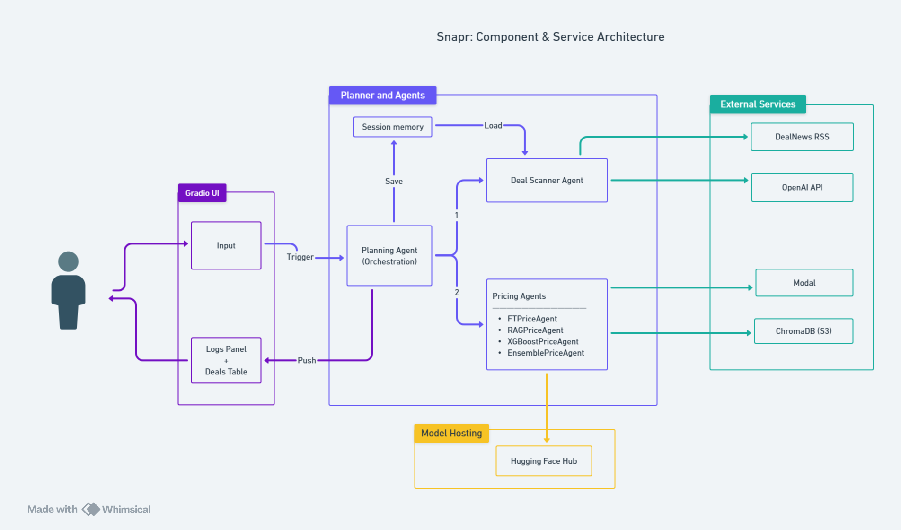

# 🧱 System Architecture

The diagram below illustrates the high-level architecture of the {{ PROJECT_NAME_DISPLAY }} system, showing how the UI, agents, and external services interact.

*Click on image to zoom*

Each component plays a specific role:

- **Gradio UI**: Collects user input, displays logs and results.

- **Planning Agent**: Orchestrates the end-to-end pipeline.

- **DealScanner Agent**: Fetches RSS deals and selects top 5 using OpenAI.

- **Pricing Agents** (executed remotely via Modal):
    - `FTPriceAgent`: Fine-tuned LLaMA model.
    - `RAGPriceAgent`: Uses E5 embeddings, ChromaDB, and a frontier LLM.
    - `XGBoostPriceAgent`: E5 embeddings + XGBoost model.
    - `EnsemblePriceAgent`: Aggregates predictions from the three above.

- **Model Hosting**:
    - Models are stored on **Hugging Face Hub**.
    - Automatically pulled into **Modal volumes** and cached after first run.

- **External Services**:
    - **Modal**: Hosts and runs all GPU-reliant agents.
    - **ChromaDB (hosted on AWS)**: Used by the RAG agent for retrieval.
    - **DealNews RSS**: Primary data source for deal content.
    - **OpenAI API**: Used by both the DealScanner and RAG agents.
