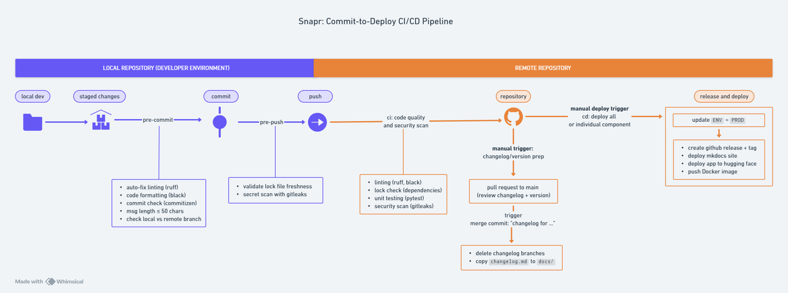

{{ snippet("_version.md") }}

# 🔁 CI/CD Workflow

- All deployments, code quality checks (`ruff`, `black`), unit tests, **security checks**, and `requirements.lock` validation are automated via GitHub Actions on every PR and push.

- See [/.github/workflows](https://github.com/{{ HF_USERNAME }}/{{ PROJECT_NAME }}/tree/main/.github/workflows) for full pipeline details.

The diagram below illustrates the full workflow — from local development (pre-commit hooks) to production deployment via CI/CD.

*Click on image to zoom*

---

## ✅ CI/CD Prerequisites

### 🔐 Add Required Secrets

Before pushing to remote repo, go to the Github Repo:

**Settings → Secrets and variables → Actions → New repository secret**

Add the following:

- `OPENAI_API_KEY`
- `DOCKER_TOKEN`
- `HF_TOKEN`
- `GIT_USER_NAME`
- `GIT_USER_EMAIL`: *Use your GitHub-provided private email:* 

      - Go to [/settings/profile](https://github.com/settings/profile) → Emails**, enable **“Keep my email address private”**,  
      - then copy the `@users.noreply.github.com` address shown there.

---

### ⚙️ Configure Workflow Permissions

Ensure GitHub Actions has the correct permissions:

Go to Github Repo:  
   **Settings → Actions → General → Under Workflow permissions**:

   - ✅ Select: `Read and write permissions`
   - ✅ Check: `Allow GitHub Actions to create and approve pull requests`
