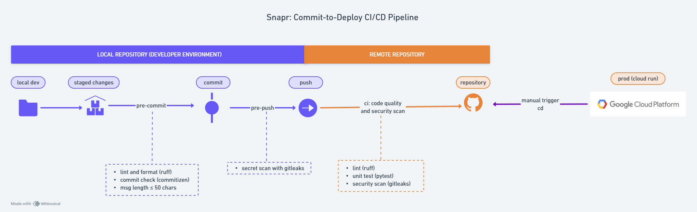

# 🔁 CI/CD Workflow

- All deployments, code quality checks (`ruff`), unit tests, **security checks** are automated via GitHub Actions on every PR and push.

- See [/.github/workflows](https://github.com/{{ HF_USERNAME }}/{{ PROJECT_NAME }}/tree/main/.github/workflows) for full pipeline details.

The diagram below illustrates the full workflow — from local development (pre-commit hooks) to production deployment via CI/CD.

*Click on image to zoom*

---

## ✅ CI/CD Prerequisites

### 🔐 Add Required Secrets

Before pushing to remote repo, go to the Github Repo:

**Settings → Secrets and variables → Actions → New repository secret**

Add the following:

- `DOCKER_TOKEN` and `DOCKER_USERNAME`
- `HF_TOKEN`and `HF_USERNAME`
- `GIT_USERNAME`
- `GIT_USER_EMAIL`: *Use your GitHub-provided private email:*

      - Go to [/settings/profile](https://github.com/settings/profile) → Emails**, enable **“Keep my email address private”**,
      - then copy the `@users.noreply.github.com` address shown there.

!!!note
      - Define `HF_USERNAME` in GitHub Actions secrets even if it's already in `.env`, because GitHub treats it as sensitive data and mask it, leading to hard-to-debug issues. Using secrets ensures consistent and reliable acces.
      - To anticipate similar issues, do the same for `DOCKER_USERNAME` — define it in GitHub Actions secrets as well.

---

### ⚙️ Configure Workflow Permissions

Ensure GitHub Actions has the correct permissions:

Go to Github Repo:
   **Settings → Actions → General → Under Workflow permissions**:

   - ✅ Select: `Read and write permissions`
   - ✅ Check: `Allow GitHub Actions to create and approve pull requests`

---

### Act Local Testing

Instead of pushing commits to GitHub to test your CI/CD pipeline, use **act** to run workflows locally.

We've created `act.mk` with all testing commands - this allows you to:

- 🧪 **Test workflows locally** before pushing to GitHub
- 🚀 **Debug CI/CD issues** without polluting git history
- ⚡ **Faster iteration** - no waiting for GitHub runners
- 💰 **Save GitHub Actions minutes** during development

All installation instructions and detailed usage are documented in the `act.mk` file.
